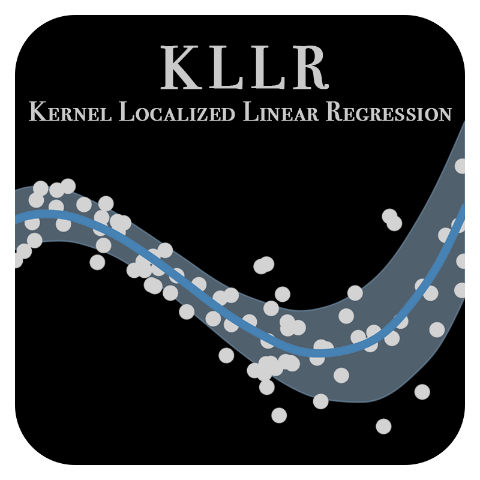

  

# Introduction

 
Linear regression of the simple least-squares variety has been a canonical method used to characterize
 the relation between two variables, but its utility is limited by the fact that it reduces full 
 population statistics down to three numbers: a slope, normalization and variance/standard deviation.
 With large empirical or simulated samples we can perform a more sensitive analysis
 using a localized linear regression method (see, Farahi et al. 2018 and Anbajagane et al. 2020).
 The KLLR method generates estimates of conditional statistics in terms of the local the slope, normalization,
 and covariance. Such a method provides a more nuanced description of population statistics appropriate
 for the very large samples with non-linear trends.

This code is an implementation of the Kernel Localized Linear Regression (KLLR) method 
that performs a localized Linear regression described in Farahi et al. (2018). It employs 
bootstrap re-sampling technique to estimate the uncertainties. We also provide a set of visualization
tools so practitioners can seamlessly generate visualization of the model parameters.

## Dependencies

`numpy`, `scipy`  `matplotlib`, `pandas`, `sklearn`, `tqdm`

## References

[1]. A. Farahi, et al. "Localized massive halo properties in BAHAMAS and MACSIS simulations: scalings, lognormality, and covariance." Monthly Notices of the Royal Astronomical Society 478.2 (2018): 2618-2632.

[2]. D. Anbajagane, et al. Stellar Property Statistics of Massive Halos from Cosmological Hydrodynamics Simulations: Common Kernel Shapes. No. arXiv: 2001.02283. 2020.

## Acknowledgment

## Quickstart

To start using KLLR, simply use `from kllr import regression` to
access the primary function. The exact requirements for the inputs are
listed in the docstring of the regression() function further below.
An example for using TATTER looks like this:

      from kllr import kllr_model
       
       lm = kllr_model()
       xrange, yrange_mean, intercept, slope, scatter =
           lm.fit(x, y, [0.0, 1.0], nbins=11, GaussianWidth=0.2)

